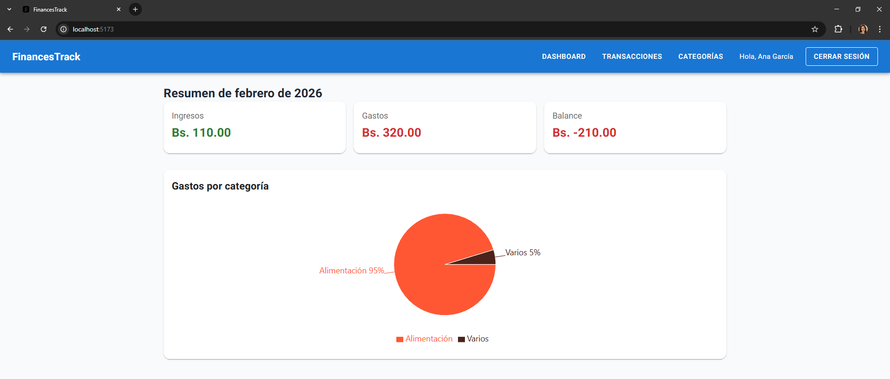
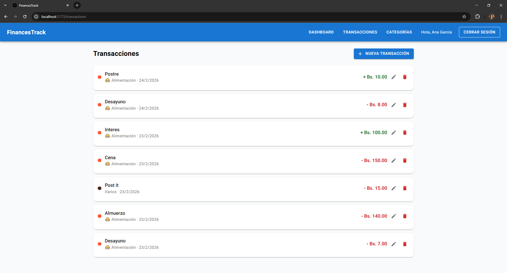

# FinTrack Frontend

Personal finance management app built with React, TypeScript, and Material UI.

## 🚀 Tech Stack

- React 19 + TypeScript
- Vite
- Material UI
- Tailwind CSS
- Recharts
- React Router DOM

## 📋 Features

- User authentication (login & register)
- Income and expense tracking
- Custom categories with colors and emojis
- Dashboard with charts and monthly summary
- Protected routes

## Project Images



## ⚙️ Setup

1. Clone the repository
2. Install dependencies:
```bash
npm install
```

3. Create `.env` file based on `.env.example`:
```
VITE_API_URL=http://localhost:5276/api
```

4. Run the app:
```bash
npm run dev
```

## 🔗 Backend

This frontend connects to the [FinTrack API](https://github.com/dalbacarrasco/finance-track-backend).